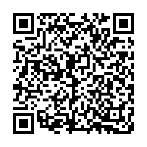
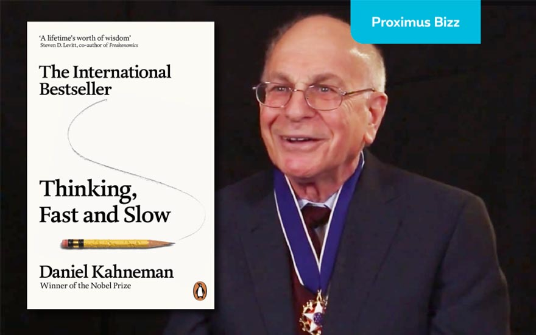

```{r setup, include=FALSE}
knitr::opts_chunk$set(echo = FALSE)
```
        
# Software Engineering and "The other CRT"

This is a brief summary of *Cognitive Reflection in Software Verification and Testing*, presented at the [Software Engineering Education and Training (SEET 2023) track of the IEEE International Conference on Software Engineering](https://conf.researchr.org/track/icse-2023/icse-2023-SEET) in Melbourne, Australia and published in the proceedings.

This presentation page is available at [learnbyfailure.com/the-other-crt](https://learnbyfailure.com/the-other-crt/) and its source is available on [GitHub](https://github.com/kbuffardi/the-other-crt/).

## Getting Started

First, let's begin with a few [questions in a poll](https://pollev.com/kbuffardi)



## Behavioral Economics

The **Cognitive Reflection Test** ([Frederick 2005](https://doi.org/10.1257%2F089533005775196732)) was motivated by Tversky and Kahneman's research that lead to a Nobel Prize in Economics. They identified how consumers do not act in their rational best interests because of cognitive biases.


^Photo courtesy of Proximus.be

In Kahneman's best-selling book *Thinking, Fast and Slow* he described our brain's two systems of decision-making:

* **System 1** is fast and reflexive and particularly susceptible to our emotions and intuitions
* **System 2** is slower, deliberate, and utilizes conscious calculations and reasoning

The **Cognitive Reflection Test** is a proxy for how likely an individual is to inhibit System 1 and demonstrate **Cognitive Reflection** (using System 2). It is inversely correlated with:

  * Gambler's fallacy
  * Sunk cost fallacy
  
**In what ways might "Cognitive Reflection" play a role in software engineering?**

**Discuss and share**: [tinyurl.com/the-other-crt](https://tinyurl.com/the-other-crt)


# Full Paper

The full paper will be available soon.

<!--
[ACM Digital library](https://doi.org/10.1145/3502718.3524778)

To cite this paper, use the following reference in your bibliography:

> Kevin Buffardi and Richert Wang. 2022. Integrating Videos with Programming
Practice. In Proceedings of the 27th ACM Conference on Innovation and Technology in Computer Science Education Vol 1 (ITiCSE 2022), July 8–13, 2022, Dublin, Ireland. ACM, New York, NY, USA, 7 pages. https://doi.org/10.1145/3502718.3524778

Or import the following *BibTeX* reference:

```
@inproceedings{10.1145/3502718.3524778,
author = {Buffardi, Kevin and Wang, Richert}, title = {Integrating Videos with Programming Practice},year = {2022}, isbn = {9781450392013}, publisher = {Association for Computing Machinery}, address = {New York, NY, USA}, url = {https://doi.org/10.1145/3502718.3524778}, doi = {10.1145/3502718.3524778}, abstract = {There is an increasing variety of tools available to support students outside of the classroom as they learn how to program. However, broadening participation in computer science will also require these tools to reinforce inclusivity, diversity, and equity. To address these needs, two Hispanic-Serving Institutions, California State University, Chico (Chico State) and University of California, Santa Barbara (UCSB), are collaborating to produce video tutorials featuring students from historically marginalized communities. In these videos, students demonstrate uses of programming concepts in contexts that relate to their lives and interests. This experience report describes the development of the videos and associated programming practice problems. In a mixed-method observational study (n=188) of CS1 courses at the two universities, we investigated students' engagement with the videos and practice problems. Preliminary findings revealed that when the videos and practice problems were provided as separate links, students tended to watch the videos but not engage in the practice platform. Consequently, this paper also describes the development of Codewit.us, which integrates video lessons with an adaptive drill-and-practice programming interface. We found that when presented with the integrated interface, students were more likely to engage with practice in tandem with watching videos (instead of just watching videos without practice, as previously observed). The paper also describes thematic analysis of students' qualitative feedback on the videos and practice problems.}, booktitle = {Proceedings of the 27th ACM Conference on on Innovation and Technology in Computer Science Education Vol. 1}, pages = {241–247}, numpages = {7}, keywords = {computer science education, broadening participation, adaptive learning system, drill-and-practice, programming, cs1, coding, codewit.us, elearning, video}, location = {Dublin, Ireland},
series = {ITiCSE '22} }
```
/-->
